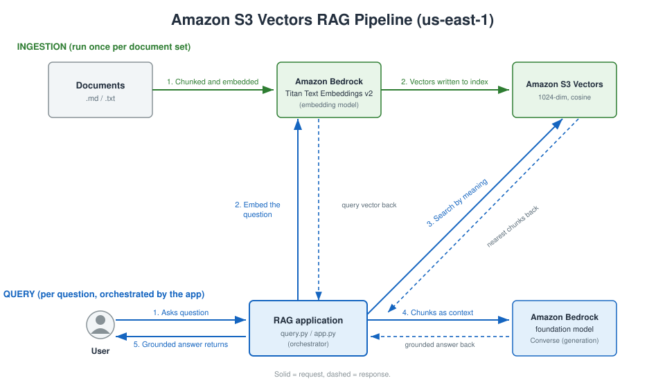
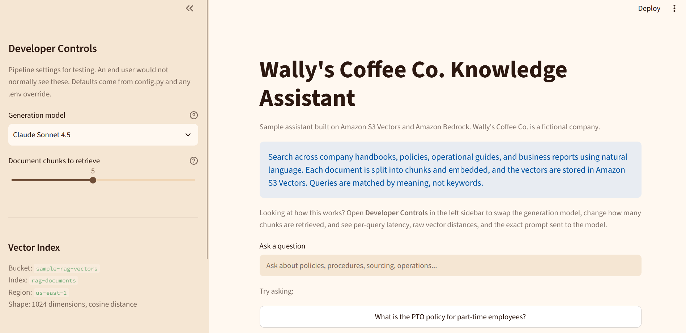

# Sample: Amazon S3 Vectors RAG Pipeline

A Retrieval-Augmented Generation (RAG) sample built on Amazon S3 Vectors and Amazon Bedrock. It
answers questions about your own documents by retrieving the most relevant passages from an S3 vector
bucket and passing them to a foundation model, which returns a natural-language, grounded answer and cites its sources.

> **This is a sample application intended for educational purposes. It is not intended for use in
production environments. See [CONTRIBUTING](CONTRIBUTING.md) for more information.**

## Why S3 Vectors?

Amazon S3 Vectors is a bucket type purpose-built for storing and querying vector embeddings. Note
that it is not a setting you enable on an existing general purpose bucket. A vector bucket is a
separate resource with its own API namespace and boto3 client (`s3vectors`), created specifically for
semantic similarity search. It holds one or more vector indexes, each a searchable collection of
vectors that share the same dimension and distance metric.

Traditional RAG architectures include a separate vector store, whether that is a provisioned cluster,
a hosted third-party service, or a serverless index that bills a capacity minimum. Each one is
another system to size, secure, and pay for. S3 Vectors builds that layer within the familiar
architecture of Amazon S3, providing the same elasticity, durability, and availability as general
purpose buckets while
[reducing the total cost to upload, store, and query vectors by up to 90%](https://aws.amazon.com/about-aws/whats-new/2025/12/amazon-s3-vectors-generally-available).

> **Note: Using Bedrock Knowledge Bases as a managed alternative with S3 Vectors.** Amazon Bedrock
> Knowledge Bases is a feature within Amazon Bedrock that can also use S3 Vectors as its store,
> managing the chunking, embedding, and retrieval that this sample does by hand. It sits on the same
> S3 Vectors building block underneath, so the two fit together. For those who want a managed path and
> do not need to see or change the individual steps, Knowledge Bases may be the better fit. This
> sample is for when you want that visibility and control.
> See [Building cost-effective RAG applications with Amazon Bedrock Knowledge Bases and Amazon S3 Vectors](https://aws.amazon.com/blogs/machine-learning/building-cost-effective-rag-applications-with-amazon-bedrock-knowledge-bases-and-amazon-s3-vectors/).

Key characteristics:

- Serverless, with charges based on storage and queries
- No minimum capacity or provisioned throughput
- Up to 10,000 indexes per vector bucket and 2 billion vectors per index
- Subsecond query performance

### When another vector store fits better

S3 Vectors is tuned for low cost at scale with subsecond queries, not for the lowest possible
latency. Applications that require
single-digit millisecond latency at high QPS, hybrid keyword-plus-vector search, or vectors next to
operational records are generally better served by other solutions, such as
[Amazon DynamoDB](https://aws.amazon.com/blogs/aws/amazon-dynamodb-now-supports-real-time-vector-search-at-any-scale/),
Amazon OpenSearch Service, or Amazon Aurora with pgvector.

## Architecture



The application code is the orchestrator. In this sample it makes each call itself, embedding,
retrieving, and generating in turn and getting a result back at each step. The application is
`ingest.py` for ingestion and `query.py` or `app.py` for queries. There are two flows, run at
different times. Ingestion (green) loads documents into the index and is re-run whenever documents
change, while query (blue) is what the end user does. In the diagram a solid line is a request and a
dashed line is the response.

Both flows go through the same index and the same embedding model, Amazon Titan Text Embeddings v2,
because a similarity comparison only means something when the query and the documents were embedded
the same way. On a query the application embeds the question with Titan, retrieves the nearest chunks
from Amazon S3 Vectors, then calls the Bedrock foundation model with those chunks as context. Adding
documents later is fine, but changing `EMBEDDING_MODEL_ID` after the index exists forces a rebuild.
The query always retrieves before it answers, so a correct answer comes from the documents.

This sample runs locally so the RAG mechanics stay visible. In a production application the same
retrieve-and-generate logic can run on compute services such as AWS Lambda or within a
container on Amazon EKS, behind an API and a web frontend.

### How It Works

**Ingestion.** `discover_documents()` finds the `.md` and `.txt` files, `chunk_text()` splits each
into overlapping token-bounded chunks, and `embed_text()` turns every chunk into a 1024-dimension
vector with Titan. `store_vectors()` writes them with `put_vectors` in batches of up to 500, the
service maximum per call. Each vector carries `source_file`, `chunk_index`, and `category` metadata,
plus the chunk text under `source_text`. That chunk text is stored as a non-filterable metadata key,
which is the S3 Vectors best practice for fields you read back but never filter on.

**Query.** The question is embedded with the same model, then `retrieve()` calls `query_vectors` for
the nearest chunks and their metadata. `build_prompt()` assembles those chunks into a prompt that
instructs the model to answer only from the supplied context, and `generate_answer()` calls the
Bedrock `converse` API and returns the answer with its source files.

## Project Structure

```
sample-s3-vectors-rag-pipeline/
├── README.md
├── requirements.txt
├── .env.example
├── .gitignore
├── architecture.svg        # Architecture diagram (committed)
├── demo-screenshot.png     # Streamlit UI screenshot
├── provision.py            # Creates S3 Vector Bucket + Index
├── ingest.py               # Document ingestion pipeline
├── query.py                # RAG query pipeline (CLI + interactive)
├── app.py                  # Streamlit web UI
├── config.py               # Configuration (env var overrides)
├── chunker.py              # Text chunking logic
├── embeddings.py           # Bedrock Titan Embeddings wrapper
├── errors.py               # Custom exception classes
├── cleanup.py              # Deletes vector bucket and index
├── .streamlit/
│   └── config.toml         # Streamlit theme
├── data/
│   └── sample/             # 10 sample documents (fictional, self-authored)
├── tests/                  # Unit and integration tests
├── CODE_OF_CONDUCT.md
├── CONTRIBUTING.md
├── THIRD-PARTY-LICENSES    # Dependency licenses
└── LICENSE                 # MIT-0
```

## Prerequisites

- An AWS account with access to Amazon S3 Vectors and Amazon Bedrock
- Model access enabled in Amazon Bedrock for Amazon Titan Text Embeddings v2 and your chosen
  generation models, in the region you plan to use
- Python 3.10 or later
- AWS CLI configured with credentials (`aws configure`)

### IAM Permissions

The principal running this sample needs permissions for S3 Vectors and Bedrock model invocation.
Documents are read from the local filesystem, so no general purpose S3 bucket access is needed. The
policy below grants only the actions this sample calls, scoped to the sample's own bucket and index.
Replace `REGION`, `ACCOUNT_ID`, and the bucket and index names if you changed them from the defaults
in `config.py`.

```json
{
  "Version": "2012-10-17",
  "Statement": [
    {
      "Sid": "S3VectorsBucketAndIndexManagement",
      "Effect": "Allow",
      "Action": [
        "s3vectors:CreateVectorBucket",
        "s3vectors:CreateIndex",
        "s3vectors:DeleteIndex",
        "s3vectors:DeleteVectorBucket"
      ],
      "Resource": "arn:aws:s3vectors:REGION:ACCOUNT_ID:bucket/sample-rag-vectors"
    },
    {
      "Sid": "S3VectorsDataAccess",
      "Effect": "Allow",
      "Action": [
        "s3vectors:PutVectors",
        "s3vectors:QueryVectors",
        "s3vectors:GetVectors"
      ],
      "Resource": "arn:aws:s3vectors:REGION:ACCOUNT_ID:bucket/sample-rag-vectors/index/rag-documents"
    },
    {
      "Sid": "BedrockModelInvocation",
      "Effect": "Allow",
      "Action": [
        "bedrock:InvokeModel"
      ],
      "Resource": "*"
    }
  ]
}
```

The two S3 Vectors statements split the actions by resource level. Creating and deleting the bucket
and index act on the bucket ARN, while writing, querying, and reading vectors act on the index ARN.
`s3vectors:GetVectors` sits alongside `s3vectors:QueryVectors` because metadata filtering and
returning metadata both need it. The `bedrock:InvokeModel` resource is left broad because the default
generation model is a cross-region inference profile. To scope it, list the profile ARN along with
the foundation model ARN in each region the profile routes to.

## Getting Started

### Installation

```bash
git clone <repository-url>
cd sample-s3-vectors-rag-pipeline
pip install -r requirements.txt
cp .env.example .env
aws configure
```

### Step 1: Provision Resources and Ingest Documents (~3 min for sample data)

Create the vector bucket and index, then ingest the sample documents:

```bash
python provision.py
python ingest.py --source data/sample/
```

Ingestion prints a summary in the form `Ingested X chunks from Y files`. If you change what metadata
is stored, for example the `category` field, run `python cleanup.py` first and then re-provision and
re-ingest, since the vectors in an existing index carry the old metadata.

### Step 2: Query the Pipeline

```bash
python query.py --question "your question"
```

The answer prints along with the source files it was drawn from.

### Step 3: Interactive Mode

```bash
python query.py --interactive
```

Ask questions repeatedly in one session. Submit an empty line to exit.

### Step 4: Streamlit UI

```bash
streamlit run app.py
```

Opens at http://localhost:8501, framed as an internal knowledge assistant. The center column is
the end-user view, with a question box, the generated answer, and an expandable Referenced
Documents section showing each chunk and its similarity score.



The sidebar, under **Developer Controls**, holds builder controls and per-query diagnostics,
including latency split by stage. Against this sample index a warm vector search runs roughly 150 to
200 ms while answer generation takes a few seconds, so retrieval is a small share of the wait. The
model selector and chunk-count slider start from whatever `config.py` and your `.env` resolve to, and
`TOP_K` is an upper bound, since approximate search can return fewer chunks than requested.

## What You'll See

The bundled documents are the internal records of **Wally's Coffee Co.**, a fictional regional
coffee chain with 18 locations in the Pacific Northwest. There are handbooks, operational guides,
supplier contracts, business reviews, and customer feedback reports. Because the company is
invented, none of this exists in any model's training data, so a correct answer can only come from
retrieval.

| Example Query | What Happens | Output |
|---|---|---|
| "What is the PTO policy for part-time employees?" | Retrieves chunks from the employee handbook | Specific answer with PT vs FT policy details, cited to source |
| "Where do we source our Ethiopian beans and what is the roast profile?" | Retrieves chunks from the sourcing guide | Origin details (Yirgacheffe), roast profile, and seasonal rotation info |
| "How did online subscriptions perform in Q3?" | Retrieves chunks from the Q3 business review | Specific growth numbers (34% increase) with context from Wally's memo |
| "How do I fix the POS system when it freezes?" | Retrieves chunks from the IT systems guide | Step-by-step troubleshooting from Sam Ogilvie's guide |
| "What is our parental leave policy?" | Retrieves chunks, finds nothing on the topic | Declines and says the answer is not in the provided context, rather than inventing a policy |

That last row is the interesting one. Nothing in the corpus covers parental leave, so the model says
so instead of guessing, and it can only do that because the grounding instruction in `build_prompt()`
holds it to the retrieved context rather than its training. That is what "grounded" means, and it is
the step RAG adds on top of retrieval.

### Filtering to a subset of documents

Each chunk is stored with a `category` in its metadata (`hr`, `operations`, `finance`, `marketing`,
`it`). You can restrict retrieval to one category with S3 Vectors metadata filtering, which evaluates
the filter and the similarity search in the same call.

```bash
python query.py --question "What is the PTO policy for part-time employees?" --filter category=hr
```

The same question without the filter searches the whole corpus. That kind of metadata control comes
from calling the API directly, and the Streamlit UI exposes it as a category selector.

## Configuration Options

Settings are defined in `config.py` and can be overridden with environment variables or a local
`.env` file.

| Variable | Default | Description |
|----------|---------|-------------|
| `VECTOR_BUCKET_NAME` | `sample-rag-vectors` | Name of the S3 vector bucket |
| `INDEX_NAME` | `rag-documents` | Name of the vector index within the bucket |
| `EMBEDDING_MODEL_ID` | `amazon.titan-embed-text-v2:0` | Bedrock model used to embed text |
| `GENERATION_MODEL_ID` | `us.anthropic.claude-sonnet-4-5-20250929-v1:0` | Bedrock model used to generate answers |
| `AWS_REGION` | `us-east-1` | Region for Amazon Bedrock and Amazon S3 Vectors |
| `TOP_K` | `5` | Number of chunks retrieved per query |

`config.py` also defines `CHUNK_SIZE` (500) and `CHUNK_OVERLAP` (50), which control how documents
are split during ingestion, and lists alternative generation model identifiers as comments.

Because every generation model is invoked through the Bedrock `converse` API, changing
`GENERATION_MODEL_ID` is sufficient to switch models. No code changes are required.

## Cleanup

Delete the vector index and bucket when you are finished:

```bash
python cleanup.py
```

The script lists what it will delete and asks for confirmation. Pass `--yes` to skip the prompt.
Deleting the index also deletes the vectors stored in it.

To do the same with the AWS CLI:

```bash
aws s3vectors delete-index \
  --vector-bucket-name sample-rag-vectors \
  --index-name rag-documents

aws s3vectors delete-vector-bucket \
  --vector-bucket-name sample-rag-vectors
```

## Testing

```bash
pytest
```

The suite covers unit tests, property-based tests, and integration tests. Integration tests are
skipped unless `RUN_INTEGRATION_TESTS=1` is set, because they create live AWS resources and invoke
Bedrock models.

## Security

See [CONTRIBUTING](CONTRIBUTING.md) for more information.

## License

This library is licensed under the MIT-0 License. See the [LICENSE](LICENSE) file.

Dependency licenses are listed in [THIRD-PARTY-LICENSES](THIRD-PARTY-LICENSES). No third-party code
is bundled in this repository.
